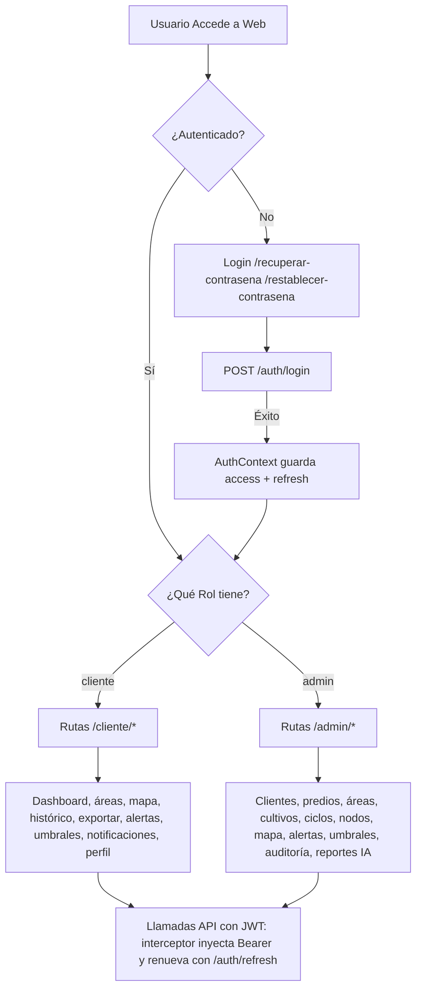

# Arquitectura del Frontend (Sensores IoT)
**Documento de Contexto para Agentes de IA y Desarrolladores**

Este documento describe la arquitectura, stack tecnológico, estado actual y reglas de desarrollo para el frontend de la plataforma IoT de Monitoreo de Sensores Agrícolas.

---

## 1. Stack Tecnológico General
- **Framework Core**: React (v18+) configurado con Vite.
- **Lenguaje**: TypeScript con `tsconfig.json` y typecheck (`tsc --noEmit`, corre en CI). Tipado progresivo (aún hay usos de `any`; el endurecimiento a strict es un cambio futuro).
- **Rutas**: `react-router` (v7). Declarado estáticamente en `routes.tsx` con componentes `Layout` anidados.
- **Estilos**: Tailwind CSS combinado con variables o valores hexadecimales estáticos derivados del *Design System Bento Box* pre-aprobado.
- **Cliente HTTP**: `axios` (v1.x) con interceptores para JWT.
- **Iconografía**: `lucide-react`.
- **Gráficos**: `recharts` (para visualización de series de tiempo).
- **Mapas (Sprint 1 Fase 2)**: `maplibre-gl` + estilo base OpenFreeMap (`https://tiles.openfreemap.org/styles/liberty`).
- **Optimización de Build**: partición manual de chunks en `vite.config.ts` para separar módulos pesados (mapas, charts, router, radix).

---

## 2. Estructura del Proyecto (`/frontend/src/app`)
La arquitectura está basada en dominios funcionales (Feature-driven / Role-based):

```text
src/app/
├── components/       # Componentes reusables de UI (Botones, Tarjetas, Input, etc.)
│   ├── navigation/   # Menús (DesktopSidebar.tsx, MobileTabBar.tsx)
│   ├── notifications/ # Alertas en UI (AlertsPopover)
│   └── ProtectedRoute.tsx # HOC para blindar rutas según el Rol y JWT.
├── context/          # React Context API para estado global (AuthContext, SelectionContext, ThemeContext)
├── hooks/            # Custom hooks (e.g., useIsMobile.ts, usePageVisibility.ts)
├── layouts/          # Envoltorios de interfaz (RootLayout, AdminLayout, ClientLayout)
├── pages/            # Vistas enrutadas
│   ├── admin/        # CRUD admin + Gateways (/admin/gateways)
│   ├── auth/         # Autenticación y recuperación (Login/Forgot/Reset)
│   └── client/       # Dashboards y datos de agricultores (ClientDashboard, Histórico, etc.)
│   └── shared/       # Pantallas compartidas entre roles (AlertsCenterPage)
├── services/         # Integración y llamadas HTTP (api.ts para base axios)
├── App.tsx           # Entry point general integrando el AuthProvider y RouterProvider
└── routes.tsx        # Definición del árbol de rutas y protección
```

---

## 3. Estado de la Integración (Mock -> API Base de Datos)
Actualmente el frontend está en fase de **transición de datos estáticos hacia consumo real del backend FastAPI**, con Fase 2 Lite cerrada.

- **Fase 1 (Completada)**: Autenticación. `LoginPage` conecta a `/api/v1/auth/login`. El JWT se decodifica con `jwt-decode`, se guarda en `localStorage` y se gestiona mediante `AuthContext`. El `api.ts` de Axios inyecta automáticamente el header `Authorization: Bearer <token>` y maneja las redirecciones por `401 Unauthorized`.
- **Fase 2 Lite (Finalizada)**: Centro de alertas y popover conectados a `/api/v1/alerts`, bitácora administrativa en `/api/v1/audit-logs`, gestión de umbrales para Admin y Cliente (ownership por área), preferencias de notificación del cliente y flujo de recuperación de contraseña (`/api/v1/auth/forgot-password`, `/api/v1/auth/reset-password`).
- **Fase 2 Completa - Sprint 1 (Completado)**: módulo geoespacial en cliente y admin con consumo de `/api/v1/nodes/geo`, filtros jerárquicos globales para admin, y optimizaciones de carga (lazy/prefetch/chunking).
- **Fase 2 Completa - Sprints 4 y 5 (Completados)**: módulos de IA — reportes (`/api/v1/ai-reports`) y asistente conversacional (`/api/v1/ai-assistant/chat`) + consumo de uso IA (`/admin/consumo-ia`).
- **Fase 3 (Completada)**: reemplazo de `mockData` por datos reales (`/api/v1/readings`, `/api/v1/readings/latest`, `/api/v1/readings/availability`); `ProfilePage` y `PropertyDetail` consumen el API real.
- **Fase 4 (Parcial)**: Semáforos de estado para datos prioritarios en dashboard cliente usando estado en tiempo real de lectura + umbral activo.

### 3.1 Módulo de Alertas en UI (Activo)

- `components/notifications/AlertsPopover.tsx`: campana global con contador y últimas alertas.
- `pages/shared/AlertsCenterPage.tsx`: listado completo con filtros, paginación y marcado de leídas.
- `services/alerts.ts`: cliente HTTP para `/api/v1/alerts`, `/api/v1/alerts/unread-count` y `/api/v1/alerts/{id}/read`.
- Integración en layouts de Admin y Cliente para visibilidad transversal.

### 3.2 Módulo de Auditoría en UI (Activo - Admin)

- `pages/admin/AuditLogsPage.tsx`: listado con filtros, paginación y detalle por evento.
- `services/auditLogs.ts`: cliente HTTP para `/api/v1/audit-logs` y `/api/v1/audit-logs/{id}`.
- Ruta protegida: `/admin/auditoria`.

### 3.3 Módulo de Umbrales en UI (Activo - Admin/Cliente)

- `pages/admin/ThresholdManagement.tsx`: CRUD de umbrales por área/parámetro/severidad (reutilizado para ambos roles).
- `services/thresholds.ts`: cliente HTTP para `/api/v1/thresholds`.
- Rutas protegidas: `/admin/umbrales` y `/cliente/umbrales`.
- En vista cliente, el filtro de área y el formulario de alta toman por defecto el `selectedArea` del `SelectionContext` para reducir fricción operativa.

### 3.4 Semáforos de Prioridad en Dashboard Cliente (Activo)

- `pages/client/ClientDashboard.tsx`: indicadores visuales (Optimo, Riesgo, Critico) para:
	- `soil.humidity`
	- `irrigation.flow_per_minute`
	- `environmental.eto`
- El estado se deriva en tiempo real de `GET /api/v1/readings/priority-status` (última lectura + umbrales activos del área seleccionada), sin depender del estado leída/no leída de alertas.

### 3.5 Preferencias de Notificación en Cliente (Activo)

- `pages/client/NotificationPreferencesPage.tsx`: configuración por área/tipo/severidad/canal y switch global.
- `services/notificationPreferences.ts`: cliente HTTP para:
	- `/api/v1/clients/me/notification-settings`
	- `/api/v1/notification-preferences`
	- `/api/v1/notification-preferences/bulk`
- Ruta protegida: `/cliente/notificaciones`.

### 3.6 Recuperación de Contraseña (Activo)

- `pages/auth/ForgotPasswordPage.tsx`: formulario público para solicitar enlace por correo.
- `pages/auth/ResetPasswordPage.tsx`: formulario público para restablecer contraseña con token.
- Integración con backend en:
	- `/api/v1/auth/forgot-password`
	- `/api/v1/auth/reset-password`
- Rutas públicas:
	- `/recuperar-contrasena`
	- `/restablecer-contrasena?token=...`

### 3.7 Estrategia de Polling en UI (Optimizada)

- `hooks/usePageVisibility.ts`: pausa el polling cuando la pestaña no está visible.
- `pages/client/ClientDashboard.tsx`: refresco periódico (30s), solo en pestaña visible, con guardas para evitar solicitudes simultáneas.
- `components/notifications/AlertsPopover.tsx`: polling deshabilitado en la ruta de centro de alertas y cuando la pestaña está oculta; también evita solicitudes concurrentes y usa `/api/v1/alerts/unread-count` para el badge de no leídas.
- `pages/shared/AlertsCenterPage.tsx`: auto-refresh periódico (30s) solo en pestaña visible y evita solapamiento de peticiones.

### 3.8 Módulo Geoespacial Base (Fase 2 Sprint 1)

- `pages/client/ClientMapPage.tsx`: vista de mapa para cliente con filtros por predio/área, marcadores por nodo, panel de detalle y leyenda persistente por estado.
- `pages/admin/AdminMapPage.tsx`: vista de mapa global para admin con filtros por cliente/predio/área, modo marcadores o clusters, capas por estado de frescura y leyenda persistente.
- `services/nodes.ts`: cliente HTTP para `GET /api/v1/nodes/geo`.
- `services/routePreload.ts`: utilitario para precargar pantallas de mapa y reducir tiempo de primera navegación.
- `routes.tsx`: rutas protegidas `/cliente/mapa` y `/admin/mapa`.
- `routes.tsx`: carga diferida (lazy) de pantallas geoespaciales con `Suspense`.
- `components/navigation/DesktopSidebar.tsx` y `components/navigation/MobileTabBar.tsx`: acceso de navegación al mapa + prefetch condicional en interacción.
- Fallback UX: cuando un nodo no tiene coordenadas, se muestra en listado lateral de "Nodos sin GPS".

### 3.9 Módulo IA (Fase 2, Sprints 4-5)

- `pages/shared/AIChatPage.tsx`: asistente conversacional para ambos roles (`/cliente/asistente-ia`, `/admin/asistente-ia`) con texto + widgets dinámicos (KPIs, tabla, gráfica).
- `pages/shared/AIReportsPage.tsx` y `AIReportDetailPage.tsx`: listado y detalle de reportes IA (`/api/v1/ai-reports`).
- `pages/admin/AIAssistantUsagePage.tsx`: observabilidad de consumo IA (`/admin/consumo-ia`).
- `services/aiAssistant.ts`, `services/aiReports.ts`, `services/aiAssistantUsage.ts`: clientes HTTP tipados.
- Nota: el streaming del chat es simulado en el frontend; la respuesta completa llega del backend.

---

## 4. Diseño y UI (UI Guidelines)
El sistema usa un "Design System" estricto tipo *Bento Box* orgánico:
- **Colores Principales**: Crema Base (`#F4F1EB`), Hueso (`#F9F8F4`), Arena (`#E2D4B7`), Marrón oscuro (`#3B312B`), Verde Sage (`#6D7E5E`).
- **Formas**: Bordes muy redondeados (`rounded-[24px]` o `rounded-[32px]`).
- **Responsive**: Se sigue estrategia Mobile-First. En Móvil, la navegación ocurre abajo (Bottom-Bar: `MobileTabBar`); en Desktop, es lateral (`DesktopSidebar`). Se intercambian respondiendo a `useIsMobile()`.

---

## 5. Flujo de Navegación por Rol



- El flujo de sesión: el interceptor de `services/api.ts` ante un 401 intenta **una vez** renovar el access token con `POST /auth/refresh` (refresh token persistido por `AuthContext`); si falla, limpia sesión y redirige a `/`.
- Los items de navegación tienen **fuente única** en `components/navigation/items.ts` (`clientNavItems`/`adminNavItems`), consumidos por `DesktopSidebar` (desktop) y `MobileTabBar` (móvil, misma paridad de rutas).
- Polling en vistas clave (dashboard, alertas, mapas) con guardas de concurrencia y pausa cuando la pestaña está oculta (`usePageVisibility`); mapas en lazy loading con prefetch condicional.

---

## 6. Reglas Inquebrantables para el AI (Agent Directives)

1. **Gestión de Estado**: Usa `React Context` y Custom Hooks para estado transversal. NO intentes introducir Redux o Zustand a menos que el usuario lo exija explícitamente.
2. **Peticiones HTTP**: Jamás uses `fetch()`. Usa siempre la instancia preconfigurada de `axios` ubicada en `src/app/services/api.ts` importándola como `api`.
3. **Manejo de Rutas**: Toda validación de acceso de usuarios debe basarse en el rol provisto por el JWT (`admin` o `cliente`) procesado a través de `<ProtectedRoute allowedRole="..." />`.
4. **Respetar Modelo de Base de Datos**: El backend envía las lecturas en estructura "Wide-Table" en BD, pero la respuesta JSON (`ReadingResponse`) es **anidada por categoría y en inglés**: `soil.humidity`, `irrigation.flow_per_minute`, `environmental.eto`. Referirse siempre a los campos JSON anidados.
5. **UI no destructiva**: Al actualizar un componente de `mockData` a API, no destruyas la estructura CSS Tailwind original del layout y estilo. Solo reemplaza de dónde provienen las variables/arrays y agrega control de estados de carga (`isLoading`) y error.
6. **URLs relativas**: Las peticiones desde axios al backend deben hacerse relativas, ej. `api.get("/readings/latest?irrigation_area_id=xx")`. El `baseURL` es `VITE_API_BASE_URL || "/api/v1"` (relativo por defecto; el proxy de Vite y Nginx resuelven `/api`).
