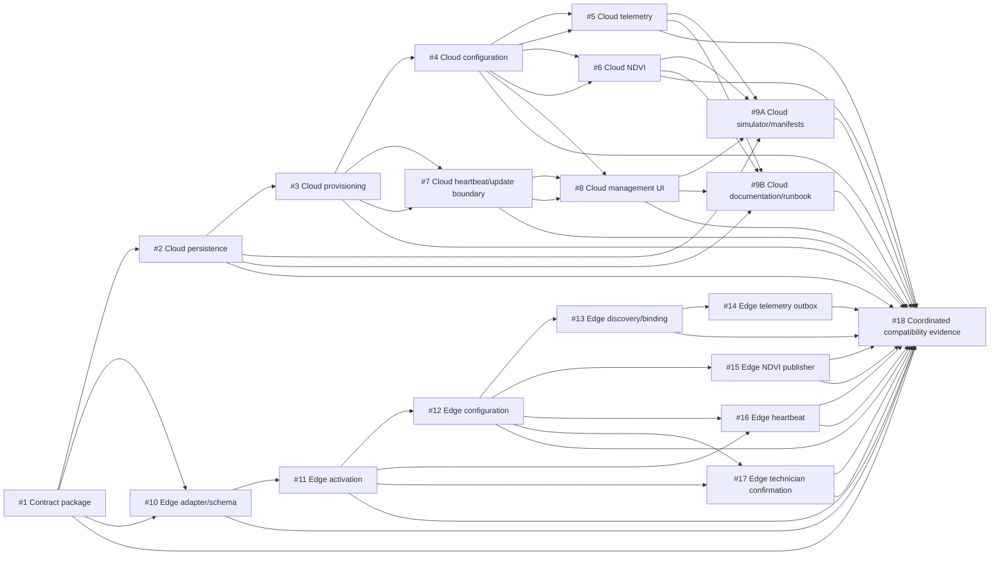

# Cross-Repository Gateway v2 Issue Plan

**Status: draft—GitHub issues not created.** This is the approved, issue-ready ownership plan for the paired IoT_Sensors and Agro.io gateway v2 work. It is a planning artifact only: it does not authorize implementation, contract publication, deployment, GitHub mutation, or a runtime cutover.

## Non-negotiable gates

- **Package #1 is a hard gate.** Every later package is blocked until `contracts/edge-cloud/v2/` is published as a complete, immutable, checksum-verified package with credential-free fixtures and all operation schemas, headers, error classes, and retry rules.
- The runtime cutover is coordinated: the cloud accepts only the gateway credential and the edge sends only the gateway credential. **There is no dual-auth window.** Legacy node keys may be retained only for rollback observation and must not authenticate after cutover.
- Telemetry remains the exact 12-field event. Latest point NDVI stays a separate point event with Sentinel-2 provenance; polygon/history NDVI remains deferred.
- `LastbornTen619` is excluded from ownership, assignment, review, and issue templates.
- **IoT execution path:** `main` → `integration/gateway-v2` → per-issue `feat/<issue>`; every IoT pull request targets `integration/gateway-v2`.
- **Agro execution path:** `origin/integration/iot-v1` → `integration/iot-v2` → per-issue `feat/<issue>`; every Agro pull request targets `integration/iot-v2`, and v1 stays intact.
- No one may push directly to `main` or either shared v2 branch. Alan is the integrator/coordinator, not an implementation issue owner; he coordinates merge and dependency order.

## Approved 18-package matrix and acceptance gate

| # | Repository | Package | Owner | Depends on | Acceptance evidence |
|---|---|---|---|---|---|
| 1 | IoT_Sensors | Publish the immutable edge-cloud v2 contract package, checksums, fixtures, and contract validation. | rickybecerra | — | The complete published package validates; `SHA256SUMS` matches; fixtures are credential-free; v1 remains frozen. |
| 2 | IoT_Sensors | Add the gateway control-plane persistence model and additive migration coverage. | Ricky | 1 | Empty MySQL 8 migration succeeds; property/configuration/binding uniqueness cases pass. |
| 3 | IoT_Sensors | Implement gateway provisioning, activation references, credential lifecycle, templates, and admin APIs. | Ricky | 1, 2 | Single-use 24-hour activation and secret-redacted provisioning/API tests pass. |
| 4 | IoT_Sensors | Implement immutable configuration polling, live binding overlay, and binding-history state transitions. | Ricky | 1, 2, 3 | Monotonic configuration, exact `304`, isolation, candidate ownership, and reassignment-history tests pass. |
| 5 | IoT_Sensors | Replace machine telemetry authentication with gateway-scoped authorization and idempotency. | Ricky | 1, 2, 4 | Gateway telemetry covers create/replay/conflict, legacy-key rejection, authorization boundaries, 12 fields, and timestamp rules. |
| 6 | IoT_Sensors | Authorize separate latest-point NDVI ingestion through the gateway configuration. | Ricky | 1, 2, 4 | Authorized point NDVI replay/conflict tests pass; polygon/history and telemetry-shaped NDVI are rejected; no NDVI telemetry field exists. |
| 7 | IoT_Sensors | Add heartbeat/status mapping and prepared-image authorization/technician confirmation boundaries. | Ricky | 1, 2, 3 | Five-minute heartbeat/status boundary and update authorization/confirmation tests pass; no OTA, scheduler, or alert behavior is added. |
| 8 | IoT_Sensors | Add the gateway management and status-separation frontend experience. | Fabián | 1, 3, 4, 7 | Admin lifecycle and status UI checks pass; no secrets render; gateway connectivity remains distinct from node freshness. |
| 9A | IoT_Sensors | Prepare cloud simulator and manifests without activating traffic. | rickybecerra | 1, 2, 3, 4, 5, 6, 7, 8 | Contract and project checks pass; manifests are credential-free; no live cutover claim is made. |
| 9B | IoT_Sensors | Author the documentation and cutover runbook without activating traffic. | fabianfugg | 1, 2, 3, 4, 5, 6, 7, 8 | The runbook records the no-dual-auth constraint and no live cutover claim. |
| 10 | Agro.io | Establish the verified v2 edge contract adapter, additive local schema, and identity-empty prepared-image boundary. | JP | 1 | The adapter refuses unpublished or checksum-mismatched packages; schema and prepared-image checks pass without secrets or identity. |
| 11 | Agro.io | Implement the online activation flow and secret-free local installation status boundary. | jpDLG101 | 1, 10 | Activation tests prove one-time generic failure handling, 0600 credential storage, payload cleanup, and no secret leakage. |
| 12 | Agro.io | Implement configuration cache/polling, `304` handling, and independent binding overlay persistence. | JP | 1, 10, 11 | Valid monotonic snapshots, stale/invalid rejection, `304`, offline last-valid use, and overlay revision checks pass. |
| 13 | Agro.io | Implement the local discovery and explicit slot-selection/binding interaction. | Fabián | 1, 11, 12 | Deterministic discovery/binding evidence proves explicit technician selection, no UID/serial telemetry leakage, and no cloud entity creation. |
| 14 | Agro.io | Implement confirmed-binding telemetry normalization and the durable telemetry outbox. | JP | 1, 10, 12, 13 | Exact 12-field payload, stable event retry, failure-class handling, and pending-data protection tests pass. |
| 15 | Agro.io | Implement the separate latest-point Sentinel-2 NDVI publisher and replay handling. | JP | 1, 10, 12 | Point-only NDVI fixture tests pass; replay/conflict behavior is preserved; NDVI never enters telemetry. |
| 16 | Agro.io | Implement the five-minute heartbeat client and freshness separation. | JP | 1, 11, 12 | The 300-second heartbeat and gateway-versus-reading-freshness checks pass without alerts or notifications. |
| 17 | Agro.io | Implement the prepared-image authorization and local technician-confirmation user flow. | JP + Fabián | 1, 11, 12 | The authorization/confirmation matrix passes and proves that installer, GitHub release, and LoRa OTA paths are not invoked. |
| 18 | Both repositories | Cross-repository acceptance gate: collect and assess compatibility and cutover-readiness evidence. **Not a GitHub implementation issue.** | Unassigned; coordinated by Alan | 1–8, 9A, 9B, 10–17 | Acceptance evidence from the technical issues establishes byte-identical vendored contract provenance, repository checks, no-dual-auth evidence, and an explicit deferred-or-passed paired smoke record before any runtime decision. Coordination is not implementation ownership. |

## Start rule

An issue may begin only after **every** package listed in its `Depends on` cell is closed and its acceptance evidence is accepted. Read-only preparation is the only exception: it may inspect approved contracts and existing code, but it must not modify source, contracts, configuration, tests, documentation, issues, or runtime state. Closing a prerequisite without accepted evidence does not satisfy this rule.

## Execution and publication prerequisite

- **IoT_Sensors:** branch `integration/gateway-v2` from `main`; create each implementation branch as `feat/<issue>` from `integration/gateway-v2`; target every implementation PR to `integration/gateway-v2`.
- **Agro.io:** branch `integration/iot-v2` from `origin/integration/iot-v1`; create each implementation branch as `feat/<issue>` from `integration/iot-v2`; target every implementation PR to `integration/iot-v2`. v1 remains intact.
- Publication requires the issue to state its execution branch and PR target, and to use the applicable path above. Direct pushes to `main`, `integration/gateway-v2`, or `integration/iot-v2` are prohibited.
- Alan coordinates dependency and merge order only. He does not own implementation issues.

## Dependency DAG

The arrows show prerequisite-to-dependent direction. The matrix remains the authoritative dependency record.



## Cross-repository critical path

The longest cross-repository chain is **#1 → #10 → #11 → #12 → #13 → #14 → #18**. It establishes the immutable shared contract, then the edge activation/configuration/binding/telemetry path needed for coordinated evidence. In parallel, the cloud completion paths **#1 → #2 → #3 → #4 → #8 → #9A → #18** and **#1 → #2 → #3 → #4 → #8 → #9B → #18** must also finish before #18 can start.

## Parallel-safe groups

These groups are safe to run concurrently once every prerequisite named for each package is accepted. They describe dependency safety only; owners must still account for their own availability.

| Readiness point | Packages that may proceed in parallel |
|---|---|
| After #1 | #2, #10 |
| After #2 and #10 | #3, #11 |
| After #3, #10, and #11 | #4, #7, #12 |
| After #4 and #12 (with #11 where listed) | #5, #6, #13, #15, #16, #17 |
| After #4, #7, and #13 | #8, #14 |
| After #2–#8 | #9A, #9B |
| After #1–#8, #9A, #9B, and #10–#17 | #18 acceptance gate only |

## Dependency order

1. Complete and freeze #1.
2. Follow the start rule and DAG for every package; package-specific predecessors in the matrix are mandatory.
3. Run the unassigned #18 acceptance gate only after all required preceding acceptance evidence is recorded. Alan coordinates the evidence; #18 is not a GitHub implementation issue, implementation ownership, or permission to deploy.

## Cross-repository issue template

Use this exact structure when GitHub issue creation is separately authorized. Create one issue per implementation package; do not create a GitHub issue for the unassigned #18 acceptance gate, and do not add an assignee or reviewer outside the matrix.

```md
Title: gateway-v2: #<package-number> <package title>

Status: draft—GitHub issues not created
Owner: <matrix owner>
Repository: <IoT_Sensors | Agro.io | Both repositories>
Change: <active change directory>
Depends on: <package numbers; #1 is mandatory>
Execution branch: <IoT: feat/<issue> from integration/gateway-v2 | Agro: feat/<issue> from integration/iot-v2>
PR target: <IoT: integration/gateway-v2 | Agro: integration/iot-v2>
Publication prerequisite: <confirm the required base, execution branch, PR target, and no direct push to main or a shared v2 branch>

Scope:
- <bounded behavior and allowed paths>

Acceptance evidence:
- <the matrix evidence, with the exact observed command/check when implemented>

Constraints:
- No dual-auth window; legacy node keys never authenticate after cutover.
- Telemetry is exactly 12 fields; NDVI is a separate latest-point event.
- Do not modify v1 changes or contracts unless this package explicitly permits a frozen pointer.
- Keep Agro v1 intact; do not push directly to `main`, `integration/gateway-v2`, or `integration/iot-v2`.
- Exclude LastbornTen619 from ownership, assignment, review, and mentions.

Handoff:
- Record the dependency evidence and the immutable v2 contract revision/checksum used.
- Alan coordinates dependency and merge order; he is not the implementation issue owner.
- Do not claim runtime cutover, deployment, or GitHub completion without observed evidence.
```

## Issue creation readiness

- Current status for all 18 implementation packages: **draft—GitHub issues not created**. The unassigned #18 acceptance gate is not a GitHub issue.
- No issue number, GitHub assignee, pull request, branch, remote operation, or git-history action is created by this file.
- The matrix is shared with `../Agro.io/openspec/changes/integration-gateway-v2/issue-plan.md`; both copies must stay semantically identical.
